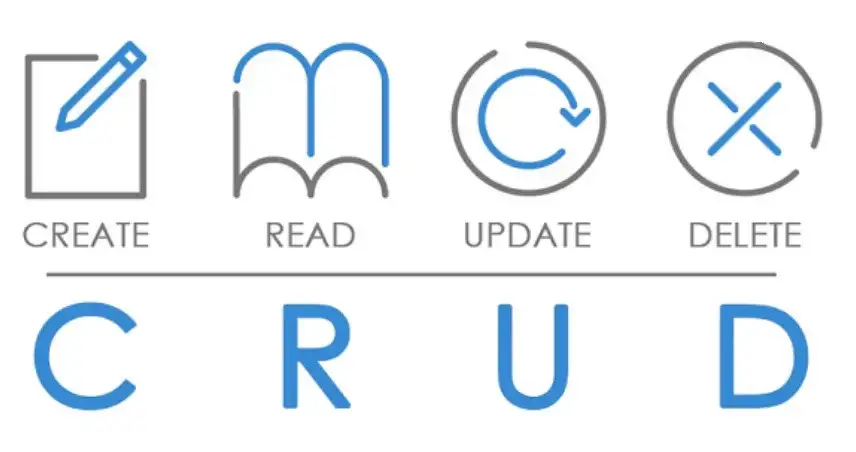

# AdonisJS-RestApi-app-**CRUD Pokemon APP**
    POST will allow users to Create Data

    GET will allow users to Read Data

    PUT/PATCH will allow users to entirely or partially Update Data

    DELETE will allows users to Delete Data

</img>

This is a Rest API Using AdonisJS , (->Node JS) using CRUD API structure (create,read,update,delete)
The main propose of this app to simply create, read, update and delete Pokemons.
 
I have used Adonis JS for structure of this node js project (Which is something like Laravel to PHP).
 
Once our project is initialized, we are going to download our Express, Knex, and Postgres dependencies:
 
Knex will allow us to migrate(Create our rows and columns) and seed(populate our tables with data).
 
Postgres will allow us to connect to our database and later utilize PostgreSQL to make queries to our database. Express will then allow us to manipulate the data utilizing API calls.
 
Database Installation:
npm i @adonisjs/lucid   node ace configure @adonisjs/lucid ->to configure (I choose MYSQL)

<b>References:</b> 
https://medium.com/@andrewm.enoe/create-a-pokemon-api-using-node-express-knex-postgresql-5e5c88ae650b
